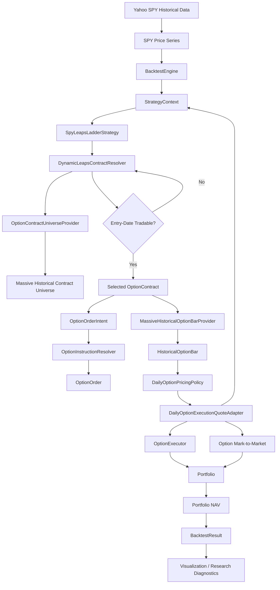
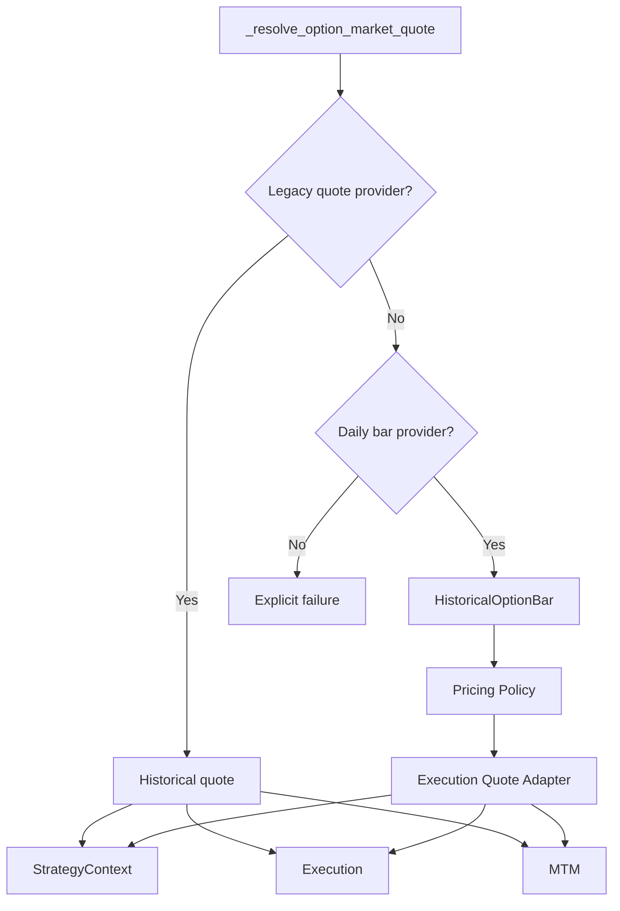
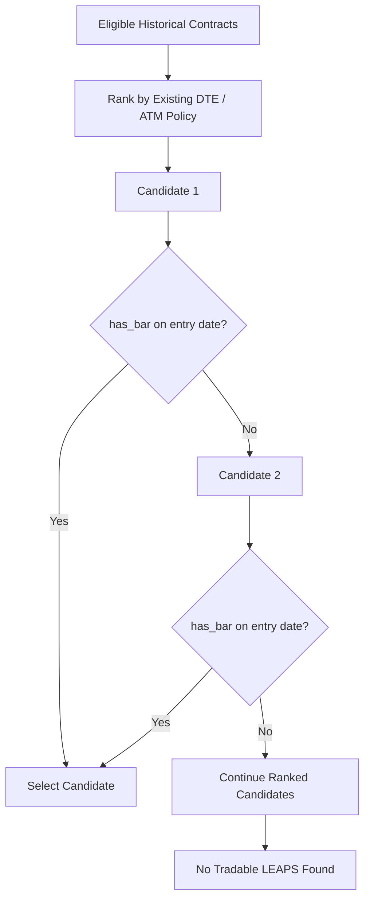
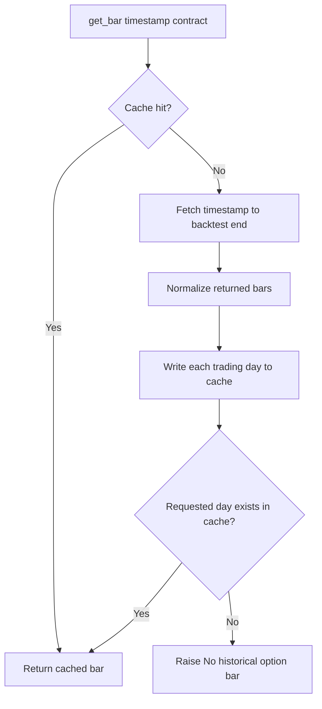
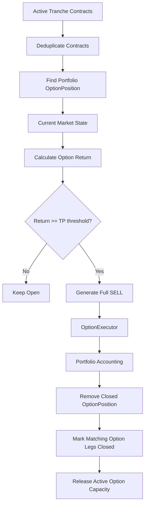

# Architecture

**Checkpoint:** 2026-08-25  
**Milestone:** Real Historical Dynamic LEAPS Backtesting

## System Overview

QuantResearch separates market data, strategy decisions, instruction
resolution, execution, portfolio accounting, analytics, and visualization.



## Strategy Interfaces

`BacktestEngine` supports:

```text
generate(prices)
generate_orders(prices)
on_bar(timestamp, price, context)
```

The dynamic runtime interface has precedence because it requires current
portfolio and market state.

A runtime strategy can return:

- no action
- one action
- multiple same-bar actions

## Market-Data Layers

### Equity data

Real historical SPY data currently comes from Yahoo Finance.

The engine consumes a `pd.Series` of daily prices and remains independent of
the download provider.

### Option reference data

Historical option contract discovery is provided through:

```text
MassiveHttpClient
        ↓
MassiveOptionContractUniverseProvider
        ↓
OptionContract
```

The resolver never consumes vendor dictionaries directly.

### Option daily aggregates

Daily option history uses:

```text
MassiveHttpClient.get_aggregate_bars(...)
        ↓
normalize_massive_option_bar(...)
        ↓
HistoricalOptionBar
```

`HistoricalOptionBar` contains:

```text
contract
timestamp
open
high
low
close
volume
vwap
```

## Daily Pricing Boundary

Daily bars do not contain true bid/ask quotes.

QuantResearch therefore inserts an explicit research-policy layer:


Current default policy:

```text
BUY  = close
SELL = close
MARK = close
```

The adapter is a compatibility boundary. Its `bid` / `ask` attributes are
execution proxies, not claims about historical quoted markets.

## Unified Option Market-State Resolution

`BacktestEngine` resolves option market state through one internal path.



This keeps strategy and execution independent from the underlying market-data
frequency.

## Dynamic LEAPS Resolution

The resolver currently applies:

```text
CALL only
365 <= DTE <= 548
target DTE = 456
```

Ranking priority:

1. distance from target DTE
2. strike distance from current underlying price
3. expiration date
4. strike

### Tradability-aware resolution

Historical reference availability is not enough.

A candidate must also have an entry-date daily option bar.



The tradability provider is optional so existing static and legacy behavior
remains backward compatible.

## Option-Bar Provider

`MassiveHistoricalOptionBarProvider` has distinct responsibilities.

### `get_bars(...)`

Retrieve and normalize a date range.

### `get_bar(...)`

Engine-facing single-date lookup.

### `has_bar(...)`

Entry-date tradability probe. It intentionally requests only the requested
day and does not auto-load the full remaining backtest window.

### `preload(...)`

Explicit range fetch and cache population.

### `set_backtest_range(...)`

Configure automatic remaining-window loading.

## Automatic Range Loading



This design means a new dynamically selected contract normally performs one
remaining-range HTTP request, after which daily engine lookups are cache
reads.

## Contract Universe Cache

`MassiveOptionContractUniverseProvider` caches identical historical queries
using normalized:

```text
timestamp
expiration_date_gte
expiration_date_lte
```

A provider instance is bound to one underlying.

This avoids repeated contract reference calls when tests or strategies resolve
the same historical universe more than once.

## HTTP Reliability

Massive HTTP calls use a shared retry / backoff helper for 429 responses.

Retry behavior:

- respect `Retry-After` when supplied
- exponential backoff otherwise
- print retry progress
- eventually raise if retry capacity is exhausted

Retry is a reliability mechanism. Caching / range loading is the main
historical-backtest efficiency mechanism.

## StrategyContext

Before `on_bar(...)`, the engine builds a context containing:

- current cash
- copied option positions
- current option market-state adapters

Current missing data is allowed. A quote-dependent decision can skip rather
than inventing market state.

## SPY + LEAPS Ladder

`SpyLeapsLadderStrategy` owns strategy-state transitions.

Responsibilities:

- running peak
- drawdown levels
- equity deployment
- option deployment
- dynamic contract resolution
- take-profit detection
- option-capacity release
- later recycling
- lifecycle ledger updates

## Tranche Lifecycle

`SpyLeapsTranche` stores:

```text
level
equity_deployed
option_deployed
option_closed
option_contract
```

Equity and option lifecycle states are independent.

Example:

```text
Tranche A:
equity_deployed = True
option_closed   = True

Later:
equity capacity = full
option capacity = available

New lifecycle tranche:
equity_deployed = False
option_deployed = True
```

## Active Capacity

`max_tranches` represents active capacity, not lifetime lifecycle records.

Important invariants:

```text
active_equity_tranches
    == number of tranches with equity_deployed=True

active_option_tranches
    == number of currently deployed / open option legs
```

Both must remain `<= max_tranches`.

The `tranches` list is ordered by lifecycle creation, not by `level`.

Therefore a real lifecycle can appear as:

```text
level 0
level 2
level 1
```

without violating the strategy model.

## Portfolio State vs Strategy State

```text
Strategy layer
    SpyLeapsTranche
        lifecycle history
        capacity state
        resolved contract

Portfolio layer
    OptionPosition
        aggregated quantity
        weighted average cost
        financial PnL
```

Several tranches may reference one contract while the portfolio owns one
aggregated `OptionPosition`.

Different contracts are valued independently.

## Take-Profit Lifecycle



A later drawdown may consume released option capacity even when no equity
capacity is available.

## Missing-Data Semantics

### Entry selection

No entry-day bar means the contract is not tradable for that historical
entry. Do not use a future bar.

### Strategy decisions

No current market state means quote-dependent decisions are skipped.

### Portfolio valuation

If a current bar is missing but a previous valid mark exists, the engine may
use the last known mark.

If no historical mark exists, valuation fails explicitly.

## Real Historical Validation

The architecture has been exercised against real Yahoo / Massive data for:

- one-day execution
- five-day MTM
- one month
- real two-tranche drawdown
- multi-contract portfolio valuation
- real TP
- option-capacity release
- later option-only redeployment
- contract rotation
- full calendar-year 2025 backtest

Full-year 2025 validation snapshot:

```text
Initial NAV:            $100,000.00
Ending NAV:             $143,226.34
Total return:           +43.23%
Maximum drawdown:       -21.68%
Realized option PnL:    $29,304.00
```

## Architectural Invariants

### Strategy and execution are separate

Strategies make decisions. Resolvers size / select. Executors execute.
Portfolio objects account.

### Vendor data is isolated

Yahoo and Massive details stay in the data layer.

### Contract existence is not tradability

Reference availability must not be confused with a tradeable daily bar.

### Daily bars are not quotes

Execution proxies are explicit policy outputs.

### Execution price and mark price are separate

The engine supports an explicit mark when available.

### Lifecycle state is not portfolio accounting

Tranches and financial positions answer different questions.

### Missing current data must not create future knowledge

Do not use later option bars to fill an entry execution.

### Active capacity is not lifetime deployment count

Historical lifecycle records may exceed `max_tranches`.

## Next Architectural Layer

The next layer is not another market-data abstraction.

It is a visualization / research-diagnostics layer consuming `BacktestResult`,
strategy lifecycle state, and portfolio history to make strategy behavior
explainable.

Initial targets:

```text
NAV
SPY benchmark
drawdown
tranche events
option lifecycle
capacity utilization
contract rotation
realized PnL
```
