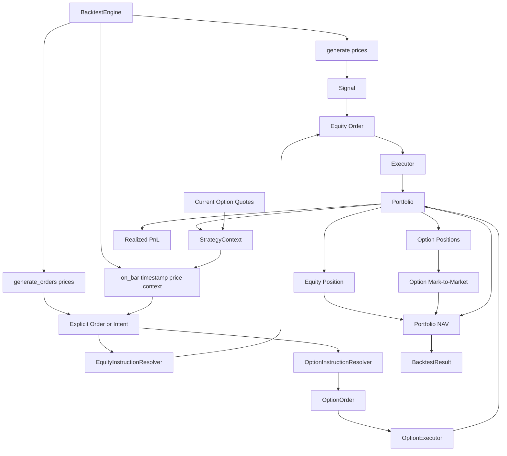
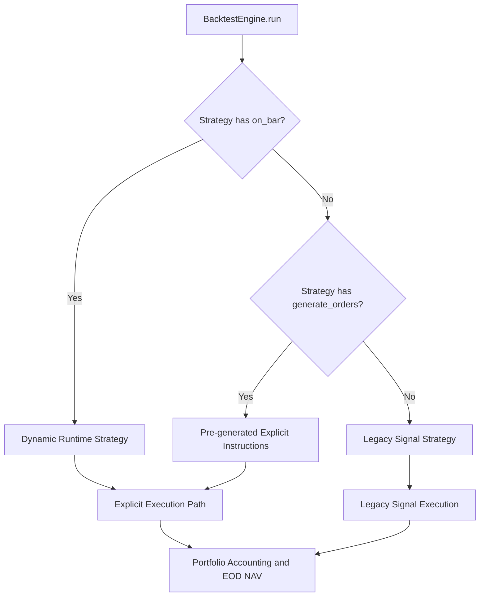
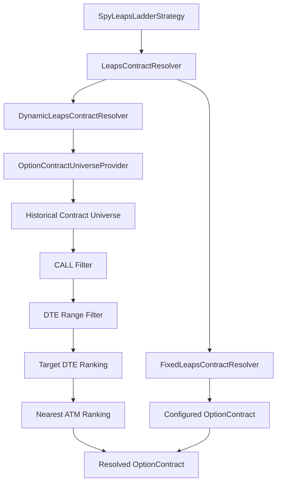
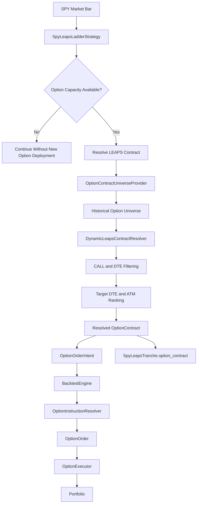
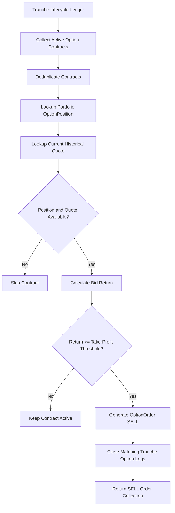
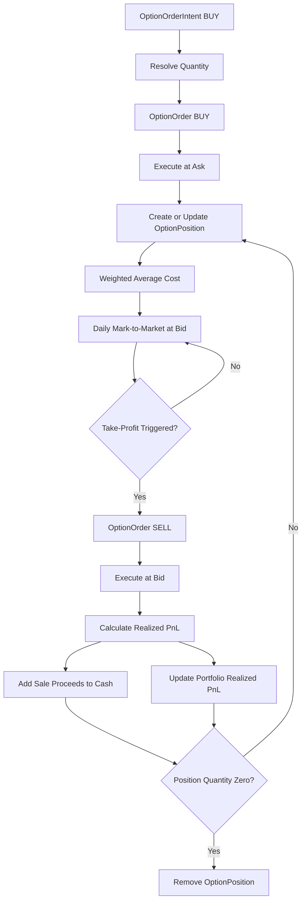
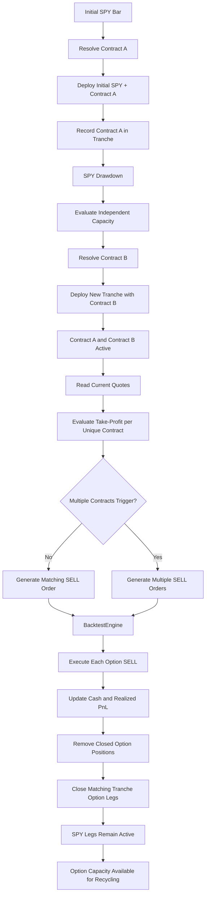

# Architecture

**Checkpoint:** 2026-08-24  
**Milestone:** Sprint 15 — Dynamic LEAPS Contract Lifecycle

## System Overview

QuantResearch separates strategy decisions, instruction resolution,
execution, portfolio accounting, and market-data access.

The backtest engine supports three strategy interfaces:

1. `generate(prices)` for legacy signal-based strategies.
2. `generate_orders(prices)` for pre-generated explicit orders or intents.
3. `on_bar(timestamp, price, context)` for runtime strategies requiring current portfolio state or option quotes.



## Strategy Interface Selection

`BacktestEngine` selects the most state-aware interface implemented by the strategy.



`on_bar()` has precedence because runtime strategies require current portfolio and market state before making each decision.

## Runtime Strategy Context

Before calling a dynamic strategy, the engine builds a `StrategyContext`.

The context exposes current cash, a copy of current option positions, and current quotes for option contracts held by the portfolio.

Missing current option quotes are allowed. A quote-dependent strategy decision can therefore choose not to act rather than inventing market data.

## Runtime Action Contract

A runtime strategy may return:

- `None`;
- one order or intent;
- a `list` or `tuple` containing multiple orders or intents.

`BacktestEngine` normalizes single and multiple actions and executes each action independently. This allows a strategy to enter multiple legs or exit multiple option contracts on the same trading day.

## Same-Day Allocation Semantics

Before executing the current day's instructions, `BacktestEngine` captures a cash snapshot. Allocation-based intents generated for that bar use the same snapshot unless the intent explicitly supplies its own `allocation_base`.

```text
capital_base =
    intent.allocation_base
    if allocation_base is explicitly supplied
    else engine-provided daily cash snapshot

budget =
    capital_base * allocation_fraction
```

This prevents a second same-day allocation from becoming smaller only because an earlier instruction already consumed cash. It also allows fixed-notional ladder tranches to size from the strategy's initial capital.

## SPY + LEAPS Ladder Strategy

`SpyLeapsLadderStrategy` is a stateful runtime strategy.

Its responsibilities include:

- maintaining the running SPY peak;
- calculating drawdown levels;
- deploying equity and option legs;
- tracking tranche lifecycle state;
- resolving LEAPS contracts at deployment time;
- evaluating contract-specific take-profit conditions;
- recycling released option capacity.

The strategy supports both fixed and dynamic LEAPS contract resolution.

## Tranche Lifecycle Model

Strategy lifecycle state is represented by `SpyLeapsTranche`.

Each tranche stores:

```text
level
equity_deployed
option_deployed
option_closed
option_contract
```

Equity and option state are deliberately independent. Closing a LEAPS position does not automatically close the SPY leg, making option capital recycling possible.

## LEAPS Contract Resolution

Contract selection is delegated to `LeapsContractResolver`.



### Fixed Resolver

`FixedLeapsContractResolver` preserves legacy fixed-contract behavior by always returning the configured contract.

### Dynamic Resolver

`DynamicLeapsContractResolver` obtains contracts from an `OptionContractUniverseProvider`.

Current default LEAPS parameters are:

```text
minimum DTE = 365 days
maximum DTE = 548 days
target DTE  = 456 days
```

Eligible contracts must be CALL options within the configured DTE range. Selection prioritizes distance from target DTE, distance between strike and current underlying price, expiration date, and strike.

## Option Contract Universe

Contract discovery is separated from contract selection.

`OptionContractUniverseProvider` defines the abstraction used by the dynamic resolver. Current implementations include:

- `StaticOptionContractUniverseProvider`
- `MassiveOptionContractUniverseProvider`

The Massive-backed provider retrieves historical contract reference data and normalizes vendor records into internal `OptionContract` objects. The strategy itself remains vendor-independent.

## Massive Option Data Boundary

Massive-specific HTTP access and normalization live in the data provider layer.

```text
Historical contract discovery
    → MassiveOptionContractUniverseProvider
    → OptionContract

Historical quote retrieval
    → MassiveHistoricalOptionDataProvider
    → HistoricalOptionQuote
```

This separation allows strategy and execution layers to operate on internal domain objects rather than vendor response dictionaries.

## Dynamic LEAPS Deployment Flow



The exact contract selected at deployment time is stored in the tranche lifecycle ledger. Later exit decisions therefore do not need to depend on the original legacy `self.leaps_contract`.

## Drawdown and Capital Recycling

The ladder tracks the running SPY peak and converts drawdown depth into trigger levels. When a new drawdown level is reached, equity and option capacity are evaluated independently.

A previous option take-profit can release option capacity while its corresponding equity exposure remains active. A later drawdown may therefore deploy an option without requiring a new equity leg, and the new option may resolve to a different contract.

```text
Earlier lifecycle:

Tranche 0
    SPY        OPEN
    Contract A CLOSED

Later drawdown:

Tranche 2
    SPY        NONE
    Contract B OPEN
```

## Multi-Contract Take-Profit

Take-profit decisions are based on active contracts recorded in the tranche ledger.

Identical contracts are deduplicated because several strategy tranches may correspond to one aggregated portfolio `OptionPosition`.



Multiple different contracts may reach the take-profit threshold on the same bar. In that case, `SpyLeapsLadderStrategy.on_bar()` returns multiple `OptionOrder` objects and `BacktestEngine` executes them sequentially.

## Tranche State vs Portfolio State

The tranche ledger and portfolio positions serve different purposes.

```text
Strategy layer
    SpyLeapsTranche
        → lifecycle history
        → deployment capacity
        → contract ownership

Portfolio layer
    OptionPosition
        → aggregated quantity
        → average cost
        → realized/unrealized PnL
```

Multiple active tranches may reference the same `OptionContract`, while the portfolio aggregates those holdings into one `OptionPosition`. Therefore the same contract produces one aggregated exit order, while different contracts can produce independent exits.

## Option Execution Lifecycle

Option execution uses executable market sides:

- BUY at ask;
- SELL at bid.



## Missing Quote Semantics

Strategy decision-making and portfolio valuation intentionally use different missing-data behavior.

For runtime strategy decisions, missing current quotes are not invented or forward-filled. Quote-dependent decisions such as take-profit are skipped for that contract.

For end-of-day valuation, if an open position does not have a current quote but a previous valid mark exists, the engine may use the last known option mark.

This prevents a stale quote from silently triggering a strategy decision while still allowing portfolio NAV calculation when historical quote data is sparse.

## SPY + Dynamic LEAPS End-to-End Lifecycle



This lifecycle has been validated through integration tests using the real `SpyLeapsLadderStrategy`, `BacktestEngine`, option execution, and portfolio accounting.

## Architectural Invariants

### Strategy and execution remain separate

Strategies generate decisions. Resolvers translate allocation intents into executable orders. Executors determine execution prices. Portfolio objects own accounting state.

### Vendor data does not enter strategy logic directly

Massive-specific response structures are normalized in the data layer. Strategies and resolvers operate on internal domain objects.

### Tranche state is not portfolio accounting

Tranches represent strategy lifecycle state. `OptionPosition` represents financial position state.

### Same contract means one aggregated exit

If multiple tranches reference the same active option contract, the strategy generates one exit for the aggregated portfolio position.

### Different contracts may exit together

If multiple distinct active contracts independently reach take-profit, they may generate multiple SELL orders on the same bar.

### Strategy decisions do not use synthetic current quotes

Missing current quotes cause quote-dependent decisions to be skipped. Portfolio valuation may separately use a previous valid mark.

### Legacy interfaces remain supported

The framework continues to support signal strategies, pre-generated-order strategies, and fixed-contract LEAPS behavior alongside the dynamic runtime architecture.

## Current Architectural Boundary

Sprint 15 resolves the earlier tranche-state limitation.

The framework now supports:

- independent equity and option lifecycle state;
- option capital recycling;
- dynamic historical LEAPS contract selection;
- contract rotation across recycling cycles;
- simultaneous active option contracts;
- contract-aware take-profit;
- same-contract exit deduplication;
- multiple option exits on the same bar;
- engine-level multi-order execution;
- portfolio accounting for those executions.

The next architectural boundary is historical data validation rather than strategy-state representation.

Sprint 16 should progressively validate:

```text
historical timestamp
        ↓
historical SPY price
        ↓
Massive historical option universe
        ↓
DynamicLeapsContractResolver
        ↓
selected OptionContract
        ↓
Massive historical option quote
        ↓
executable bid / ask
        ↓
SpyLeapsLadderStrategy
        ↓
BacktestEngine
        ↓
Portfolio and performance results
```

The first objective should be a small historical smoke test before attempting multi-month or multi-year dynamic LEAPS backtests.
