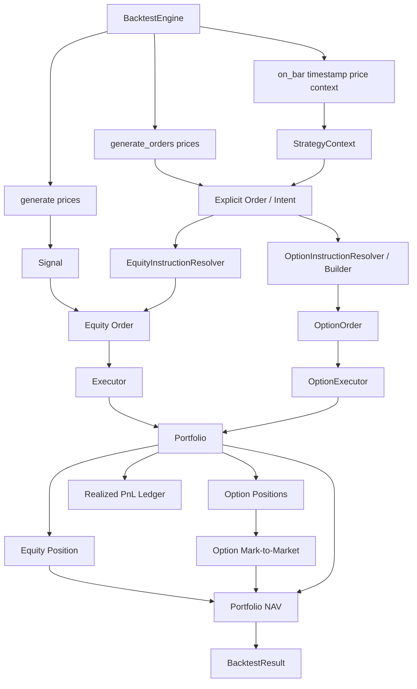
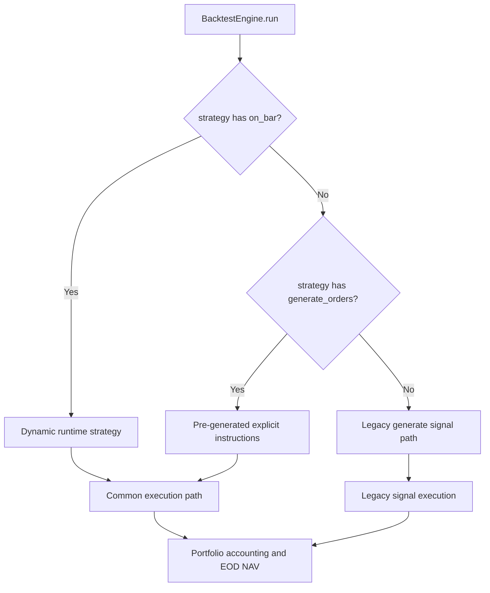
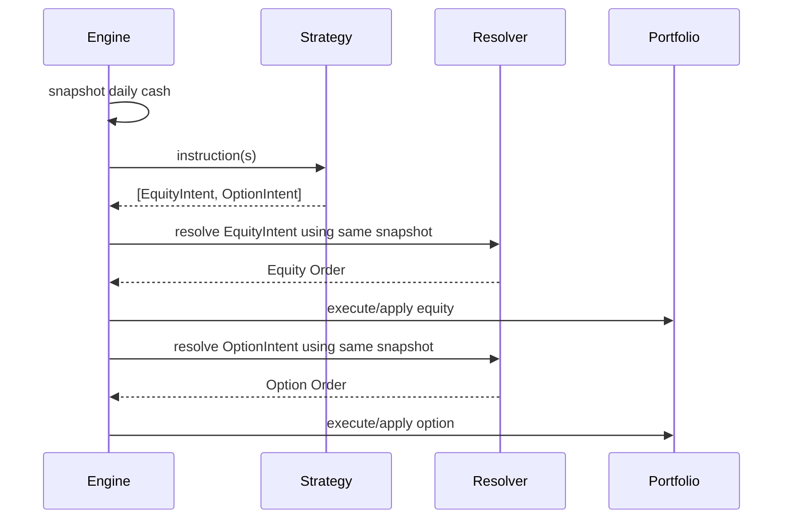
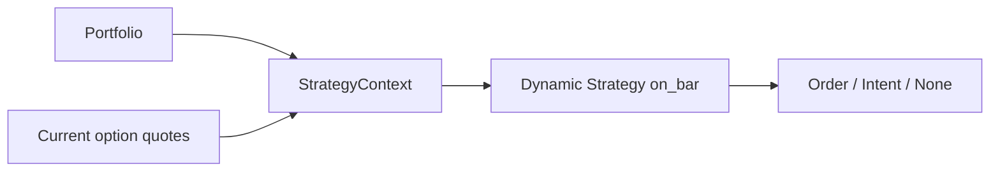
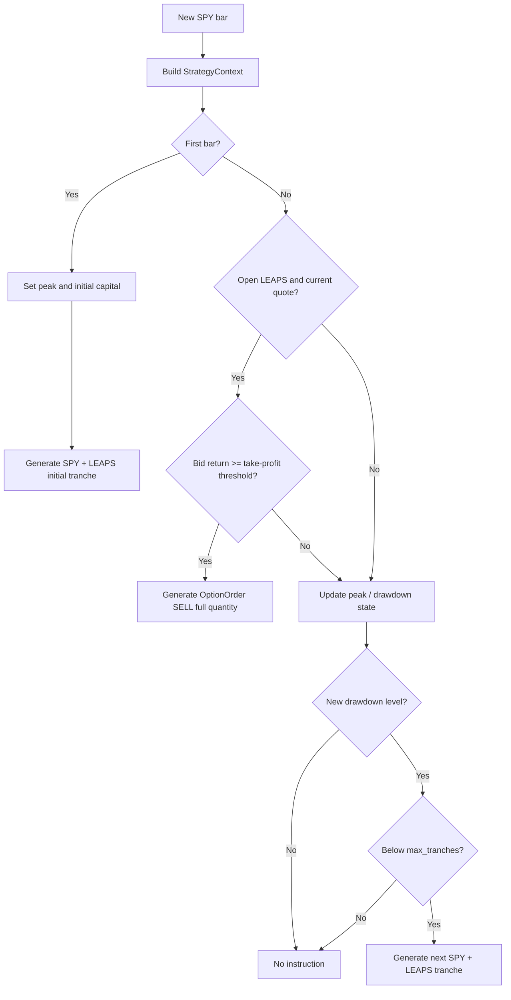
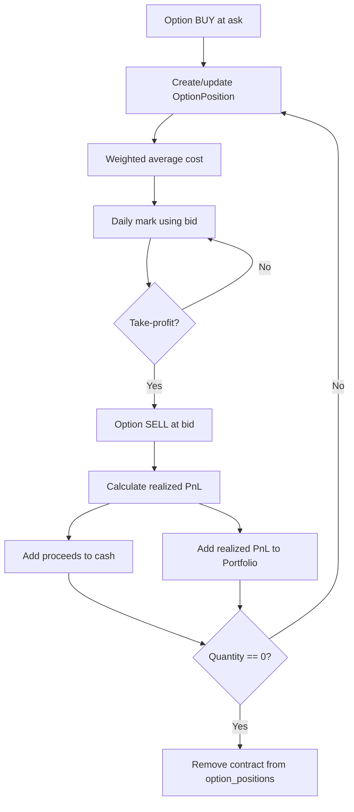

# Architecture

**Checkpoint:** 2026-08-17

## System Overview



## Strategy Interface Selection



Dynamic `on_bar()` has precedence because a strategy implementing it needs current runtime state.

## Same-Day Multiple Instructions



The allocation snapshot prevents the second instruction from unintentionally shrinking simply because the first instruction executed first.

## Allocation Base

Sizing semantics:

```text
capital_base =
    intent.allocation_base
    if allocation_base is explicitly supplied
    else engine-provided cash snapshot

budget = capital_base * allocation_fraction
```

This keeps generic strategies cash-relative while allowing fixed-notional ladder tranches.

## Runtime StrategyContext



Current context surface:

- cash
- option positions
- option quotes

A copy of the option-position mapping is exposed rather than the portfolio's dictionary itself.

## SPY + LEAPS Runtime Flow



## Option Accounting Lifecycle



## Missing Quote Semantics

Two behaviors are intentionally different:

1. **Strategy decision:** if the current option quote is missing, the runtime context does not invent one. Quote-dependent actions are skipped.
2. **Portfolio valuation:** if an open position lacks a current quote but has a previous valid mark, end-of-day valuation can use the last known option price.

## Current Design Limitation

A single `tranches_deployed` counter worked while SPY and LEAPS always entered and exited together. LEAPS take-profit now allows option exposure to disappear while SPY exposure remains.

Sprint 14.4 should replace or augment this combined state with a more expressive model before capital recycling is implemented.
